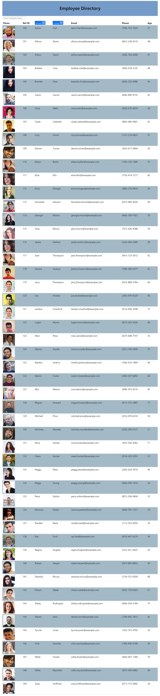

# Assignment 19:  React Employee Directory

  

***

  ## Description:
  This application allows an directory view of employees to be seen by a user. The application presents a list of 50 employees with their photo, ref id, name, email address, and their age.  There is a search bar to find employees and the first name and last names can be toggled from A to Z.    
   
***
  ## Table of Contents:
  1.  [Description](#description)
  2.  [Demonstration](#demonstration)
  3.  [Installation](#installation)
  4.  [Screenshots](#screenshots)
  5.  [Technologies](#technologies)
  6.  [Usage](#usage)
  7.  [License](#license)
  8.  [Contributing](#contributing)
  9.  [Tests](#tests)
  10.  [Questions](#questions)

***
  ## Demonstration:
  [Deployed Website Link on GitHub](https://djavanw.github.io/react_employee_directory/)

***
  ## Installation:
  To use this application, the user can fork or clone.  Then run `npm install`. See the technologies section for the application dependencies.  Then to run this application locally, then type `npm run start`.  

***
  ## Screenshots:
  ### (Deployed Application)
  

  ### (Sorting A-Z By First Name)
  

  ### (Sorting A-Z By Last Name)
  

  ### (Filter Search For Employee)
  

  ### (Filter Search Found Employee)
  

***
  ## Technologies
    - React.js
    - React Hooks
    - React Components
    - Axios
    - HTML
    - JavaScript
    - CSS
    - Bootstrap
 

  ## Usage:
  This application allows the user to search the directory by employee first or last name.  In addition, the first name or last name columns can be sorted from A to Z.  There are buttons that allow toggling between the two.  The employees for this application are generated through the randomuser.me API.   
   
***
  ## License:
  This project falls under the MIT License.  The full documentation for this license can be found at [MIT Full Documentation](https://choosealicense.com/licenses/mit).

  Below is an excerpt of the MIT License.
   
  Copyright <YEAR> <COPYRIGHT HOLDER>
    
    Permission is hereby granted, free of charge, to any person obtaining a copy of this software and associated documentation files (the "Software"), to deal in the Software without restriction, including without limitation the rights to use, copy, modify, merge, publish, distribute, sublicense, and/or sell copies of the Software, and to permit persons to whom the Software is furnished to do so, subject to the following conditions:
    The above copyright notice and this permission notice shall be included in all copies or substantial portions of the Software.
    THE SOFTWARE IS PROVIDED "AS IS", WITHOUT WARRANTY OF ANY KIND, EXPRESS OR IMPLIED, INCLUDING BUT NOT LIMITED TO THE WARRANTIES OF MERCHANTABILITY, FITNESS FOR A PARTICULAR PURPOSE AND NONINFRINGEMENT. IN NO EVENT SHALL THE AUTHORS OR COPYRIGHT HOLDERS BE LIABLE FOR ANY CLAIM, DAMAGES OR OTHER LIABILITY, WHETHER IN AN ACTION OF CONTRACT, TORT OR OTHERWISE, ARISING FROM, OUT OF OR IN CONNECTION WITH THE SOFTWARE OR THE USE OR OTHER DEALINGS IN THE SOFTWARE.

  ## Contributing:
  To contribute to this project, please send an email.  
   
  The contributors for this project are:
    - D. Javan Worthy

***
  ## Tests:
  No special test were run to complete this application.  However, console logs were setup throughout the application to ensure data was being pulled from the API.  

***
  ## Questions:
  - The GitHub profiles for this project are:
   - https://github.com/djavanw
 
  - If there are any questions, please contact Alex at emailfake@gmail.com.